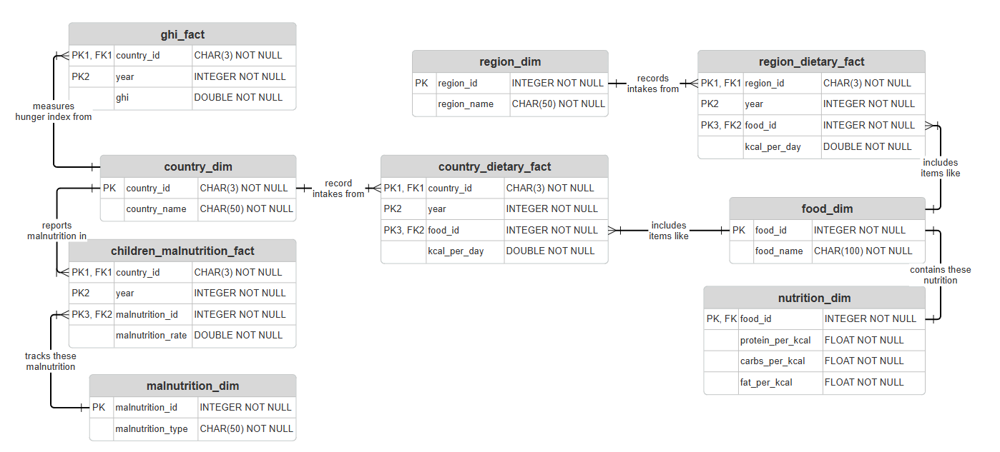

# CSC2008-Global-Hunger-Insights
## Overview
The Global Hunger & Dietary Insights project aims to analyze global malnutrition trends, food consumption patterns, and nutritional availability using structured datasets. 
## Datasets
This project processes and models data related to:

- Dietary Composition – analyzing per capita food consumption across countries and regions.
- Nutritional Composition – mapping food types to macronutrient content (protein, carbohydrates, fats).
- Global Hunger Index (GHI) – measuring hunger severity per country.
- Children’s Malnutrition Rates – tracking stunting, wasting, and underweight prevalence.

## Data Modelling Approach

For efficiency, scalability, and accuracy, the project followed data modelling process involving normalisation, data cleaning, and proper schema design. 

### Normalization
The data was normalized down to the Boyce-Codd Normal Form (BCNF) standard, achieved by addressing repeating groups (1NF), partial dependencies (2NF), and transitive dependencies (3NF). 

- First Normal Form (1NF): The raw dataset contained repeating groups where multiple food types were stored as separate columns rather than rows. These columns were unpivoted into rows.

- Second Normal Form (2NF): Partial dependencies were removed by splitting dimension attributes into separate tables, leaving quantitative metrics and references in the fact tables. 

Third Normal Form (3NF): Transitive dependencies were eliminated by creating an additional nutrition_dim table to separate food nutrient values from food_dim. 

### Data Cleaning

### Schema Design